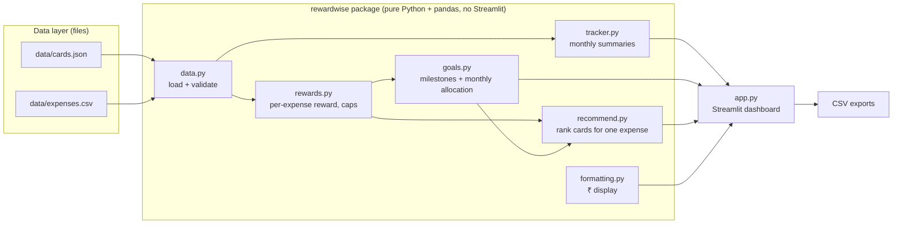

# Architecture



## Module responsibilities

| Module | Responsibility | Depends on |
|---|---|---|
| `data.py` | Load and validate cards and expenses; one place where bad input is rejected | pandas |
| `rewards.py` | What one card pays for one expense: eligibility, rate, cap. **Never** includes milestones | none |
| `goals.py` | Milestone progress, scoring a whole month, choosing an allocation, explaining it | `rewards`, `formatting` |
| `recommend.py` | Rank all cards for a single purchase; explain a finished monthly plan in plain language (`explain_plan`, `plan_story`); score simpler baseline strategies (`strategy_comparison`) | `rewards`, `goals`, `formatting` |
| `tracker.py` | Monthly totals, category-wise and card-wise spending, spend-to-date per milestone | `goals` |
| `app.py` | Input and display only | everything above |

**Rule:** the dependency arrows only point one way and nothing in `rewardwise/` imports Streamlit,
so every engine can be unit-tested without a browser.

## Data flow for the monthly allocation
1. Expenses are validated into a DataFrame (`data.normalize_expenses`).
2. Rows with status `actual` and a card assigned become **prior spend** towards that card's milestone
   (`tracker.prior_spend_from_actuals`).
3. Rows with status `planned` become the expenses to allocate.
4. `goals.recommend_allocation` scores allocations with `goals.evaluate_allocation`
   (direct rewards after caps + vouchers newly unlocked) and keeps the best.
5. `recommend.explain_plan` turns the result into short reasons per expense and `recommend.plan_story` tells the milestone story;
   `recommend.strategy_comparison` scores the plan against two simpler strategies. The UI shows them and exports CSV.
   (`goals.explain_allocation`, the compact one-line version from v0.2, is kept and still tested but the UI no longer uses it.)

## Allocation method
Exhaustive search when `cards ** expenses <= 100,000` (guaranteed best under the rule model);
otherwise a labeled heuristic (best-immediate start + single-move local search, not guaranteed optimal).
See `docs/design_decisions.md`.

## Benefit model (v0.3 scenario alignment)

RewardWise does not simply select the highest reward-rate card.

```
Total Benefit   = Reward + Discount + Points Value + Other Benefits      (per expense-card pairing)
Immediate Benefit = sum of Total Benefit over all allocated pairings       (only Reward is capped monthly)
Final Score     = Immediate Benefit + newly unlocked milestone value
```

* **Part 1 (baseline):** best complete conflict-free allocation by Total Benefit only (`goals.part1_baseline`, milestones ignored).
* **Part 2 (milestone-aware):** find milestone-triggering pairings, force one, re-solve the complete allocation (displaced
  expenses are re-evaluated), add the milestone value once, and compare with the baseline. The goal-aware allocation is
  accepted only when `Final Score > Baseline Score`. Only already-planned expenses are reassigned; no extra spending is suggested.
  `goals.milestone_reallocation_report` explains the result (trigger, displaced expense, baseline vs new allocation,
  immediate benefit lost, milestone bonus, final score, net gain).
* `goals.best_immediate_allocation` is the simple "best direct reward per purchase" **comparison** strategy. It is not Group 1.

### Production optimizer vs scenario diagrams
* The production optimizer may assign **multiple planned expenses to the same card**. Exhaustive search is used for small
  spaces (cards ** expenses <= 100,000); a heuristic fallback (best-immediate start + single-move local search) is used for larger
  ones and is **not guaranteed optimal**.
* The 3-card slides use a simplified **one-slot-per-card demonstration model** (`rewardwise/scenario_groups.py`).
  **Group 1/2/3 is a scenario/search visualization, not a separate production optimizer.**
* Fixtures for the finalized scenarios are in `data/scenarios/` and are exercised by `tests/test_scenarios.py`.

## Layers (matches the architecture slide)
* **Input:** cards + card rules, planned expenses, reward goal / milestone, optional prior eligible spend.
* **Processing:** validation (`data.py`), tracking (`tracker.py`), benefit calculation (`rewards.py`), baseline optimization
  (Part 1, `goals.part1_baseline`), milestone evaluation (`goals.py`), complete reallocation and comparison (`goals.goal_aware_plan`).
* **Output:** recommended allocation, benefit breakdown (reward / discount / points / other / total), milestone progress,
  before/after comparison, explanation, CSV export.
* Baseline allocation (Part 1) uses **total pairing benefit** (Reward + Discount + Points Value + Other Benefits), not direct rewards only.
